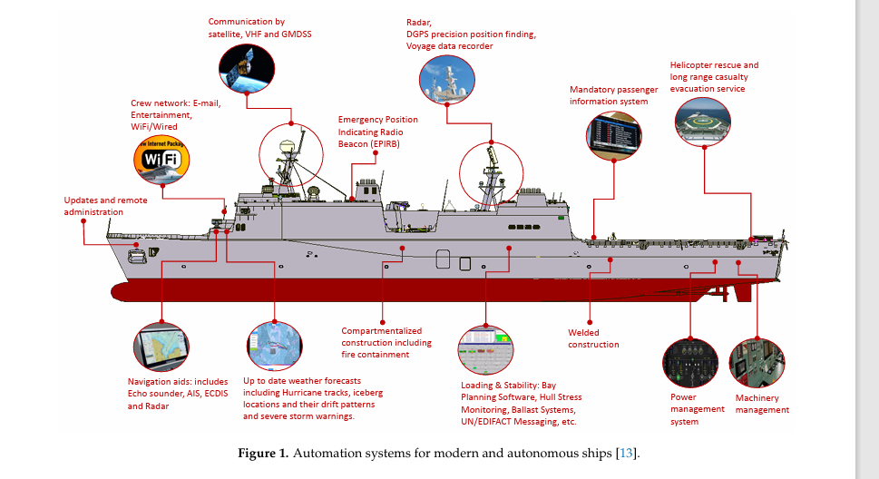

increasingly reliant on digitalisation, remote control communication and connectivity

sensosts radar, lidar, high definition cameras, thermal imageing, sonar etc

OT systmes

has detailed information on variosu cyber security risk

