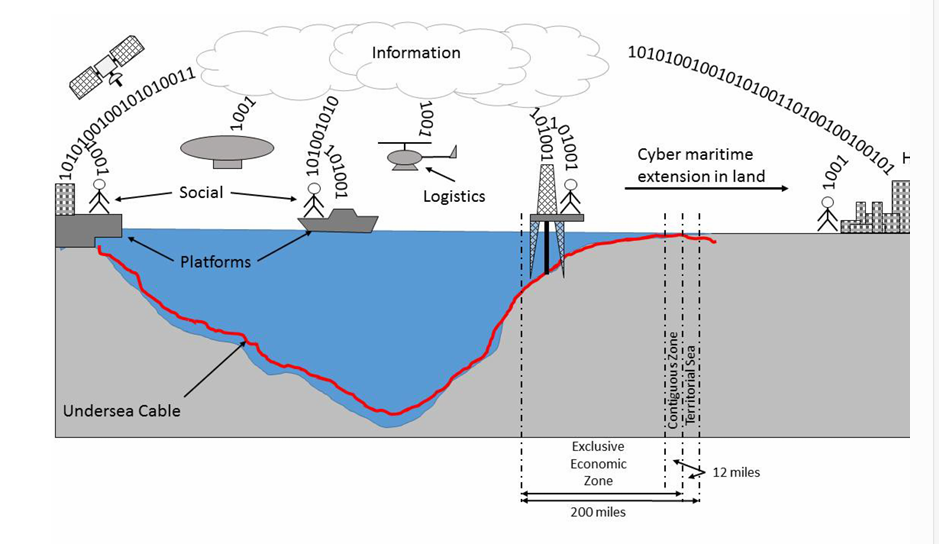

People process technology paradigm

Maritime logistics

Specifically in the military sense logistics facilitate the transformation of war from an event that is 
prone to various vulnerabilities - lack of food, disease, shortage of troops - into a process that is 
shaped by calculation and planning. Militaries can plan for long term operations, sustaining 
operations that are world-wide. Militaries can include into their planning the possibility of accidents 
and strategic surprises. Logistics makes the military resilient: fast, efficient and flexible. For navies, 
especially blue water navies, resilience far from friendly waters is a primary concern. 

